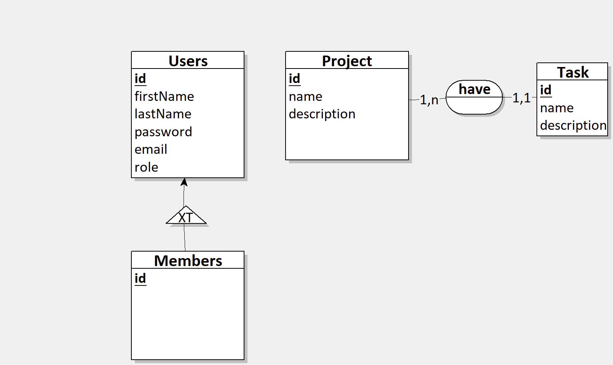

# Diagramme de Classe Modèle

Dans ce projet, nous utilisons le fichier "templateDC.loo" comme modèle pour notre travail. Pour commencer, veuillez télécharger le fichier "templateDC.loo" fourni et l'ouvrir dans le logiciel "Looping".

- Note : Il est essentiel de respecter strictement le design du modèle, y compris le maintien de la couleur de fond des entités, sans apporter de modifications.

## Reference 
[**Téléchargement du fichier modèle**](https://www.powerdesigner.biz/EN/powerdesigner-resources/trial-download-167.html)

[**Téléchargement du fichier modèle**](https://www.looping-mcd.fr/)